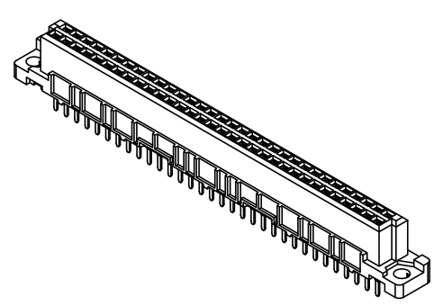
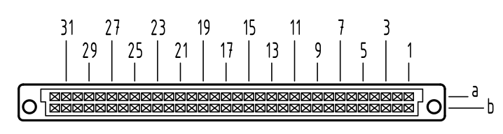
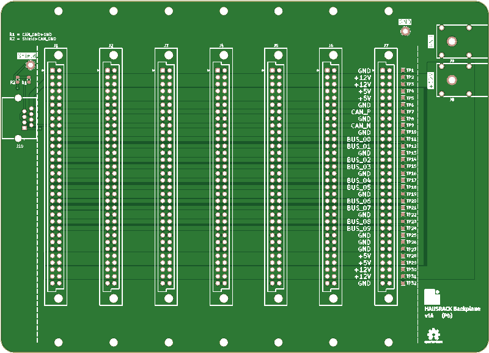
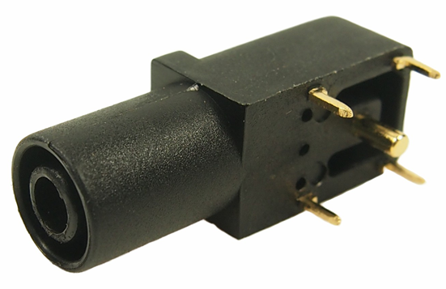

# A Bus is a Bus, Of Course, Of Course

One of the defining features of the project is using a modular backplane
in a subrack enclosure. I figured we can dive into some of the details
so far.

## Design Principles

When I was looking at how [kha](https://github.com/kiu/kha/) structured
the bus, I decided to pull a few ideas from what they did:

1. Leverage DIN 41612 for the physical format of the bus. This is a very
   well understood and documented specification, and it has been
   battle-tested over many decades.
2. Simplify the backplane routing requirement.
3. Carry both +12V and +5V. Can be locally regulated down to the needed
   voltage.

## Physical Connector

I decided to use the DIN 41612 connector because it is an absolute tank.
It has been used, at least, since the late 1980s in dozens and dozens of
critical systems. It's also relatively inexpensive and not very finicky
to work with.

{: width=100 align=left }

While kha used a 32-pin connector (2 rows of 16 pins), I've decided to
use a 64-pin connector. The reason is that this allows me to run many
more ground lines across the connector, and also double up the power. I
am using the DIN 41612 connector in it's type B configuration. This
means it has 2 rows of pins/contacts, labeled "a" and "b". The numbering
scheme is basically A1/B1-A32/B32. 

There are many other arrangements that are used in other systems, and
many have 3 or 4 rows, but this is far more than enough for this setup.
It also keeps it from even starting to look like
[VMEbus](https://en.wikipedia.org/wiki/VMEbus), which uses a 3 row
96-pin version.

In the type B configuration, the receptacle (female) connector is on the
backplane and the plug (male) is on the card at a right angle. While you
can get connectors reversed, I didn't see any reason to deviate from
this arrangement.

The connectors also have 2.8mm holes for M2.5 screws that allow them to
be _very securely_ attached to the PCBs, without needing to put any
strain on the solder joints.

## Signal Assignment

To simplify the routing enormously, I've decided to keep the "a" and "b"
rows identical. This allows for the bus to be routed straight across the
backplane. The "signals" can be broken down into a few groups:

* Ground
* Power rails, both +12V and +5V
* CAN bus (differential encoding)
* User-defined signals (BUS_*)

This breaks down to this layout, where ground is heavily interspersed
with the signals to help ensure reasonable signal integrity.

| Pin # | Row A  | Row B  |
| ----- | ------ | ------ |
| 1     | GND    | GND    |
| 2     | +12    | +12    |
| 3     | +12    | +12    |
| 4     | +5     | +5     |
| 5     | +5     | +5     |
| 6     | GND    | GND    |
| 7     | CAN_H  | CAN_H  |
| 8     | GND    | GND    |
| 9     | CAN_L  | CAN_L  |
| 10    | GND    | GND    |
| 11    | BUS_00 | BUS_00 |
| 12    | BUS_01 | BUS_01 |
| 13    | GND    | GND    |
| 14    | BUS_02 | BUS_02 |
| 15    | BUS_03 | BUS_03 |
| 16    | GND    | GND    |
| 17    | BUS_04 | BUS_04 |
| 18    | BUS_05 | BUS_05 |
| 19    | GND    | GND    |
| 20    | BUS_06 | BUS_06 |
| 21    | BUS_07 | BUS_07 |
| 22    | GND    | GND    |
| 23    | BUS_08 | BUS_08 |
| 24    | BUS_09 | BUS_09 |
| 25    | GND    | GND    |
| 26    | GND    | GND    |
| 27    | GND    | GND    |
| 28    | +5     | +5     |
| 29    | +5     | +5     |
| 30    | +12    | +12    |
| 31    | +12    | +12    |
| 32    | GND    | GND    |

## Power Capacity and Derating

One of the things I wanted to do is be able to carry 6-8A of current on
both the +12V and +5V rails. The standard for the connector specifies 2A
per pin, but you also need to
[derate](https://en.wikipedia.org/wiki/Derating) this  number for use in
the real-world. If we look at Harting's derating curve, we get this:

Most standards talk about "room temperature" at 20C, but it's typically
necessary to actually use a higher temperature in the real world. The
resistance of the copper along with all the other components will raise
the ambient temperature. If we assume 35C (95F), then we can see on the
curve that we can expect about 1.8A. As I showed above, we are using 8
pins per rail, which gives us a safe load capacity of 14.4A, well above
what we are targeting. 

We are actually safe, for this definition of safe at least, up to 98C
(208F), which is a temperature unlikely to occur in my house, even
without air conditioning in Seattle.

## PCB Layout

The layout is actually pretty simple, and only needed 2 layers for the
initial run. Depending on what signal integrity looks like, I may
convert to 4 layers, but because I was able to keep the entire back as a
ground, basically, I have reasonable confidence. The top of the board
looks like this:

{: align=right width=200}

You can see in the design how everything goes across horizontally, which
means there's no need to really "route" anything creatively. The ground
is tied together on both sides as the plated through holes connect the
two sides.

It has a 8C8P connector for CAN, two Cliff FCR7350 4mm safety banana
jacks for +12V and test points that can be used to check power and
signals. I also put all the signals on the silkscreen.

All mechanicals are in alignment with Eurocard and VMEbus standards.

You can find the [KiCad files in GitHub](https://github.com/rebma-io/hausrack/tree/main/hardware/pcb/backplane).