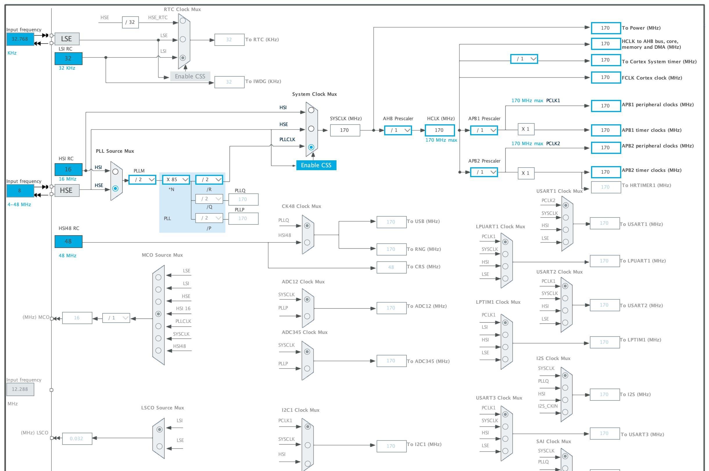

# A New Board is Born

!!! info "Where Have You Been?"
    The short answer is "around", but the real answer is more
    complicated. Due to :gestures at world:, I haven't really been
    mentally in a place where I can spend time working on things like
    this project. After a few months of just zoning out, I've realized I
    need the structure of a project to keep me focused, and so I'm
    trying to pick back up where I left off.

When last we talked, I was talking about a modular base board built
around an STM32H5, but I realized that there was another alternative ...
build it around an existing board. So, that's my plan now. This removes
a lot of design work, yes, but at least for the initial design, it lets
me focus on some other things. I've chosen to use a board from WeAct
Studio. These are the people behind the famous Blue Pill and Black Pill
STM32 boards. They also make one built around an
[STM32G474CEU6](https://github.com/WeActStudio/WeActStudio.STM32G474CoreBoard),
which is a 170MHz ARM Cortex-M4 with 128KB of RAM, 512KB of Flash, and
2 CAN-FD buses available. It's in a somewhat long 48-pin package. If you
want to buy one, you can find them on your neighborhood massive Chinese
marketplace. 

Since I'm planning to write all the software on top of
[Zephyr](http://zephyrproject.org), and this board isn't in their
already [extensive list of
boards](https://docs.zephyrproject.org/latest/boards/index.html), I
needed to add it to that. So, into the breach we go.

First, I [read the
documentation](https://docs.zephyrproject.org/latest/hardware/porting/board_porting.html).
Since the SOC is supported already thanks to a ton of work from
STMicroelectronics, it really just meant customizing for this specific
instance on this board. To do that, I needed to name the board, and then
create a bunch of files. The name I chose was `stm32g474_long` under the
`weact`
[vendor](https://github.com/zephyrproject-rtos/zephyr/blob/main/dts/bindings/vendor-prefixes.txt)
directory. Those files are:

`board.yml`

:   a YAML file describing the high-level meta data of the boards such
    as the boards names and the SOC. 

`weact_stm32h474_long.dts`

:   The hardware description in devicetree format. This declares your SOC,
    connectors, and any other hardware components such as LEDs, buttons,
    sensors, or communication peripherals (USB, etc).

`Kconfig.weact_stm32h474_long`

:   This is the base software configuration for selecting SOC and other
    board and SOC related settings. Kconfig settings outside of the
    board and SOC tree must  not be selected. To select general Zephyr
    Kconfig settings the Kconfig file must be used.

`board.cmake`

:   Provides information on flashing and debugging the board

`weact_stm32h474_long.yaml`

:   A bunch of metadata that's mostly used by the test runner to help
    understand what tests to run. Note, I don't know why this one ends
    in `yaml`, but the other in `yml`, nor whether it matters, but I
    just copied the style in the documentation.

`weact_stm32h474_long_defconfig`

:   Some Kconfig-style presets for building any application. These can
    be overridden in the application.

Rather than start from a clean slate, I actually decided to "borrow"
some of the already made board configs from an existing WeAct board, the
[STM32G431](https://github.com/zephyrproject-rtos/zephyr/tree/main/boards/weact/stm32g431_core)
model. This gave me a good head start on what I needed to do.

So let's go through the files. I hope my explanations are both
reasonably accurate and passably consumable. I'm learning this as I go
along, and so this is just my current knowledge.


## board.yml

```yaml linenums="1"
board:
  name: weact_stm32g474_long
  vendor: weact
  socs:
    - name: stm32g474xx
```

This is pretty obvious, but the name of the SOC (line 5) is something
you have to find in the [existing
repository](https://github.com/zephyrproject-rtos/zephyr/tree/main/soc).
Some of the naming isn't necessarily obvious to me, but it was pretty
easy to figure out. Once you get to the right [processor
family](https://github.com/zephyrproject-rtos/zephyr/tree/main/soc/st/stm32/stm32g4xx)
it's not too bad.


## weact_stm32h474_long.dts

This is the biggest of all of them, so let's take it from the top (post
copyright). First, this is a
[devicetree](https://docs.zephyrproject.org/latest/build/dts/index.html#dt-guide)
format, which is also used Linux.  I can't say as I consider myself to
_know_ it yet, but I've started to get a feel for it. I've elided empty
lines along the way.

```dts linenums="7"
 /dts-v1/;
 #include <st/g4/stm32g474Xe.dtsi>
 #include <st/g4/stm32g474r(b-c-e)tx-pinctrl.dtsi>
 #include <zephyr/dt-bindings/input/input-event-codes.h>
```

First, we set the version of the DTS (devicetree) schema that's in use,
then we include some existing files to set up some presets. 

```dts linenums="12"
 / {
     model = "WeAct STM32G474CEU6 Long board";
     compatible = "weact,stm32g474_long";
 
     chosen {
         zephyr,console = &lpuart1;
         zephyr,shell-uart = &lpuart1;
         zephyr,sram = &sram0;
         zephyr,flash = &flash0;
         zephyr,canbus = &fdcan2;
         zephyr,code-partition = &slot0_partition;
     };
```

The first thing to know is that the start of line 12 is the start of the
definition of a node, in this case the root (`/`) node. Like most
languages, everything inside the curly brackets is part of that
definition.

The `/chosen` node sets up some defaults. For example, line 17 says that
the node `lpuart1` is the default Zephyr console. The `&` is used a lot
like C to grab the "address of" something else. They're called
[phandles](https://docs.zephyrproject.org/latest/build/dts/phandles.html).
In this case, `lpuart1` is the [low power
UART](https://www.st.com/resource/en/product_training/stm32l4_peripheral_lpuart.pdf).
Low power means it can function in low power mode when the low-speed
(32.768KHz) clock is in effect. It is, however, limited to 9600bps at
that time.

```dts linenums="25"
     leds {
         compatible = "gpio-leds";
         blue_led: led_0 {
             gpios = <&gpioc 6 GPIO_ACTIVE_HIGH>;
             label = "User LED";
         };
     };
```

First we set up the on-board LED, in this case, an annoying blue one.
Walking through this, line 25 creates the `/leds` node to contain all
the LEDs on the board. It then says it's compatible with the `gpio-leds`
hardware feature, and creates a specific instance `/leds/led_0` that
also has an label with a different name, `/leds/blue_led` (line 27). On
line 28 it sets up the GPIO pins for that LED. Since the LED is attached
to pin PC6, we know that it's part of the C cluster of GPIO pins
(`&gpioc`), and then pin #6 in that cluster.  Finally, we tell it that
the pin is considered active, when it's high. Zephyr can tell the
difference between active high and active low pins. The `<>` defines an
array, here with 3 elements.

Note we are referencing phandles that are defined outside of our file
and have been brought in via the earlier includes.

```dts linenums="33" 
     pwmleds {
         compatible = "pwm-leds";
 
         blue_pwm_led {
             pwms = <&pwm3 1 PWM_MSEC(20) PWM_POLARITY_NORMAL>;
         };
     };
```

Next, what's an LED that you can't dim? Useless, that's what!

So, as above, we explain that it's compatible with the `pwm-leds`
feature, and name the node `/pwmleds/blue_pwm_led`. We then have to set
up the timer that specifically drives the pulse-width modulated (PWM)
signal. 

!!! note "The hidden world of timers"
    This is hidden in things like Arduino, but in Zephyr and most
    other embedded systems, you have to know which timers are able to be 
    connected to which GPIO pins. This is often considered an "alternate
    function" of the pin. On STM32 there are multiple times, and each
    timer can have multiple "channels". There's various restrictions on
    them, but that's a topic for another time.

Here, we say this PWM is on channel 1 of timer 3, with a nominal period
of 20ms, and "normal" polarity, meaning it's active high.

```dts linenums="41"
     gpio_keys {
         compatible = "gpio-keys";
         user_button: button {
             label = "User";
             gpios = <&gpioc 13 GPIO_ACTIVE_LOW>;
             zephyr,code = <INPUT_KEY_0>;
         };
     };
```

Now we define some fancy "keys". This is part of the
[gpio-keys](https://docs.zephyrproject.org/latest/build/dts/api/bindings/input/gpio-keys.html)
feature, which allows you to map GPIO pins into a set of input events,
rather than just GPIO events. Think of it as mapping the keys on a
keyboard. There are other [more
advanced](https://docs.zephyrproject.org/latest/build/dts/api/bindings/input/input-keymap.html)
options for key matrices. The properties are similar to earlier, except
this button is active when it's low (pulled to ground), and then we say
that it emits `0` into the input stream when pressed.


```dts linenums="50" 
     aliases {
         led0 = &blue_led;
         mcuboot-led0 = &blue_led;
         pwm-led0 = &blue_pwm_led;
         sw0 = &user_button;
         watchdog0 = &iwdg;
         die-temp0 = &die_temp;
         volt-sensor0 = &vref;
         volt-sensor1 = &vbat;
     };
 };
```

Here we set up a bunch of aliases that can be used to refer to things.
These work exactly like any other phandle, so referencing `&led0` is the
same as referencing `&blue_led`.

Now comes the beast of a thing .. the clock tree. This is something that
if you've never worked low-level (below Arduino, for example), you're
probably completely unfamiliar with. There are multiple clock sources,
phase-locked loops, and derivative clocks that drive everything. There's
an [excellent
tutorial](https://community.st.com/t5/stm32-mcus/part-1-introduction-to-the-stm32-microcontroller-clock-system/ta-p/605369)
on the STM32 support forum. 

```dts linenums="62" 
 &clk_lsi {
     status = "okay";
 };
```

Here we just tell Zephyr that the low-speed internal clock is "okay",
meaning you can use it. You'll see this notation somewhat frequently.

```dts linenums="67" 
 &clk_hsi48 {
     status = "okay";
 };
```

Here we do the same thing for the high-speed internal clock, which runs
at 48MHz.

```dts linenums="70" 
 &clk_hse {
     clock-frequency = <DT_FREQ_M(8)>;
     status = "okay";
 };
```
<a name="clock-fun"></a>
Now here's where it gets interesting. Here we have to tell the system
what the high-speed _external_ clock is. It just gets a repeated pulse
from the crystal, but it has no idea what that frequency is, so we tell
it that it's 8MHz.

I got this wrong initially as I misread the schematic, and it resulted
in some challenges. I like to use a [LED blink
program](#blink-for-me-baby) as the initial test because it sorts out
the clocks as well as GPIO, and when it was initially set to be a 1s
cycle, it was taking 3.something seconds. Something was off. 

It turned out that I had both `clk_hse` and `pll` wrong. I had copied
them from another SOC which has a different target clock rate, and
different oscillator frequency. There was definitely some trial and
error to sort that out as I also had to make sure I _really_ understood
the STM32 clock tree.

```dts linenums="75" 
 &pll {
     div-m = <2>;
     mul-n = <85>;
     div-p = <2>;
     div-q = <2>;
     div-r = <2>;
     clocks = <&clk_hse>;
     status = "okay";
 };
```

One of the first things that is done is to use a [phase-locked
loop](https://en.wikipedia.org/wiki/Phase-locked_loop) to create a
derivative highly accurate clock signal from the input. We tell it that
we want to use `&clk_hse` we just defined as the source (there's another
separate thing going on for the low-speed clock that's out of scope
here). Then we have to provide all the multipliers and divisors that it
needs to generate the output clock, which are documented in the chip
reference manual, but also some information is in [this
post](https://community.st.com/t5/stm32-mcus/how-to-use-stm32cubemx-to-configure-hse-high-speed-external/ta-p/49604).
The best way to get these is to use
[STM32CubeMX](https://www.st.com/en/development-tools/stm32cubemx.html)
and its clock solver to get it all right. 

To get an idea of how complex the clock system is, here's a quick
screenshot of the clock configuration section of the app:



```dts linenums="85" 
 &rcc {
     clocks = <&pll>;
     clock-frequency = <DT_FREQ_M(170)>;
     ahb-prescaler = <1>;
     apb1-prescaler = <1>;
     apb2-prescaler = <1>;
 };
```

Here we configure the reset and clock control (RCC) circuit, which is
one of the main sources that distributes and times things across the
rest of the MCU. We tell it to get its source from the PLL, and that the
target frequency is 170MHz. We then provide any scalers needed for the
various buses inside the MCU.

!!! note "Why so many knobs?"

    You might ask, why is this so damned complicated? The main reason is
    power management. If you're worrying about power consumption, say 
    because you're battery powered, slower clocks use less power. A lot 
    less. Being able to tune clocks across the system to only use the 
    "minimum" clock to get the job done lets you seriously dial down the 
    power consumption of the MCU.
    
    In our case, we don't really care because everything in mains-powered, 
    and we are only talking about milliamps. But in a battery-powered
    system, you could reduce the power consumption by a factor of 5 or
    more.

```dts linenums="93"
zephyr_udc0: &usb {
    pinctrl-0 = <&usb_dm_pa11 &usb_dp_pa12>;
    pinctrl-names = "default";
    status = "okay";
};
```
We now enter the heavy IO section of the devicetree, and we need to
start by talking about [pin
control](https://docs.zephyrproject.org/latest/hardware/pinctrl/index.html).
This is a deep topic, and is also specific to the individual MCU
architecture. Diving in, every GPIO (general purpose IO) pin has an
entire little active complex circuit inside it that not only drives it
but does a huge amount of configuration. Pin control is what decides if
the pin is just a regular IO pin, or if it's using an alternate function
(AF), like ADC or DAC. It determines if it's an input or output pin, if
it's pulled up or down, or left floating. It determines whether it's an
[open drain](https://en.wikipedia.org/wiki/Open_collector) output or
configured in
[push-pull](https://en.wikipedia.org/wiki/Push–pull_output). It's a
whole collection of switches, resistors, and other components to let you
plop a value in an IO register and have it all magically reconfigure.
There's a great introduction to how all this works (in Linux, but it's
very much the same in Zephyr) in [this
presentation](https://elinux.org/images/a/a7/ELC-2021_Introduction_to_pin_muxing_and_GPIO_control_under_Linux.pdf).

Here we're creating a node `usb` on the phandles specifically for the
USB AF on pins PA11 and PA12 as the first (0th) configuration of pin
control, which in this case is labeled as "default" and marked as OK.

```dts linenums="99"
&usart1 {
     pinctrl-0 = <&usart1_tx_pc4 &usart1_rx_pc5>;
     pinctrl-names = "default";
     current-speed = <115200>;
     status = "okay";
 };
 
 &lpuart1 {
     pinctrl-0 = <&lpuart1_tx_pa2 &lpuart1_rx_pa3>;
     pinctrl-1 = <&analog_pa2 &analog_pa3>;
     pinctrl-names = "default", "sleep";
     current-speed = <115200>;
     status = "okay";
 };
```

Something similar is happening here, but in the `lpuart1` we have
something different. We have 2 different configurations (0, 1) with
different names (aliases basically) of "default" and "sleep". We're
saying that in the normal running mode, this is the TX and RX pins for
the low-power UART #1, but when the chip is asleep, it flips to a
regular analog I/O, which allows for easier wake-up.

```dts linenums="114"
 &i2c1 {
     pinctrl-0 = <&i2c1_scl_pb8 &i2c1_sda_pb9>;
     pinctrl-names = "default";
     status = "okay";
 };
```
 
 ...

```dts linenums="120"
 &spi1 {
     pinctrl-0 = <&spi1_sck_pa5 &spi1_miso_pa6 &spi1_mosi_pa7>;
     pinctrl-names = "default";
     cs-gpios = <&gpiob 6 (GPIO_ACTIVE_LOW | GPIO_PULL_UP)>;
     status = "okay";
 };
```

Here we're defining an
[SPI](https://en.wikipedia.org/wiki/Serial_Peripheral_Interface) set of
pins. The `cs-gpios` defines the pin PB6 as the chip select line for the
SPI port, marks it as active when it's low, and then attaches a pull-up
resistor to it internally to hold it inactive by default.

```dts linenums="127"
 &spi2 {
     pinctrl-0 = <&spi2_nss_pb12 &spi2_sck_pb13
              &spi2_miso_pb14 &spi2_mosi_pb15>;
     pinctrl-names = "default";
     status = "okay";
 };
 
 &spi3 {
     pinctrl-0 = <&spi3_nss_pa15 &spi3_sck_pc10
              &spi3_miso_pc11 &spi3_mosi_pc12>;
     pinctrl-names = "default";
     status = "okay";
 };
```

More of the same here, but without the chip select defined yet. This can
be done in the user's code.

```dts linenums="141"
 &timers2 {
     status = "okay";
 
     pwm2: pwm {
         status = "okay";
         pinctrl-0 = <&tim2_ch1_pa5>;
         pinctrl-names = "default";
     };
 };
 
 &timers3 {
     st,prescaler = <10000>;
     status = "okay";
     pwm3: pwm {
         status = "okay";
         pinctrl-0 = <&tim3_ch1_pb4>;
         pinctrl-names = "default";
     };
 };
 
 stm32_lp_tick_source: &lptim1 {
     clocks = <&rcc STM32_CLOCK_BUS_APB1 0x80000000>,
         <&rcc STM32_SRC_LSI LPTIM1_SEL(1)>;
     status = "okay";
 };
```

We need to set up our timers, and we configure them for use as PWM
timers as well. The `st,prescaler` is an STM32-specific property that
says that the timer should be "scaled" down by 1000x. 

We also define a low-power tick source leveraging the low-power timer #1. 
Unfortunately, I don't actually understand the `clocks` property and
copied it from another definition. _I have no idea if it works_.

```dts linenums="167"
 &rtc {
     clocks = <&rcc STM32_CLOCK_BUS_APB1 0x00000400>,
          <&rcc STM32_SRC_LSI RTC_SEL(2)>;
     status = "okay";
 };
```

The STM32 has a real-time clock (RTC) that keeps a time and date
running as long as it's not in the most aggressive sleep state. Again,
copied, because the `clocks` property escapes my understanding and
searching.

```dts linenums="173"
 &flash0 {
     partitions {
         compatible = "fixed-partitions";
         #address-cells = <1>;
         #size-cells = <1>;
 
         boot_partition: partition@0 {
             label = "mcuboot";
             reg = <0x00000000 DT_SIZE_K(34)>;
         };
         slot0_partition: partition@8800 {
             label = "image-0";
             reg = <0x00008800 DT_SIZE_K(240)>;
         };
         slot1_partition: partition@44800 {
             label = "image-1";
             reg = <0x00044800 DT_SIZE_K(234)>;
         };
         /* Set 4Kb of storage at the end of the 512Kb of flash */
         storage_partition: partition@7f000 {
             label = "storage";
             reg = <0x0007f000 DT_SIZE_K(4)>;
         };
     };
 };
```

We need to break the flash storage into a few pieces here. We define 4
partitions for the boot loader, two versions of the code, and a 4Kb
storage area that you could lay a filesystem abstraction on top of, or
just store things directly into. 

```dts linenums="199"
 &iwdg {
     status = "okay";
 };
 
 &rng {
     status = "okay";
 };

 &die_temp {
     status = "okay";
 };
```

Just a few peripherals, the watchdog timer (`iwdg`), random number
generator (`rng`), and die temperature sensor (`die_temp`). We simply
mark them as available and ready.

```dts linenums="211"
 &adc1 {
     pinctrl-0 = <&adc1_in1_pa0>;
     pinctrl-names = "default";
     st,adc-clock-source = <SYNC>;
     st,adc-prescaler = <4>;
     status = "okay";
 };
 
 &dac1 {
     pinctrl-0 = <&dac1_out1_pa4>;
     pinctrl-names = "default";
     status = "okay";
 };
```

We wire up pin PA0 to ADC #1 channel 1. We tie it to the APB bus clock
(`st,adc-clock-source`), rather than letting it be independent, and then
we scale it down by a factor of 4 (`st,adc-prescaler`).

```dts linenums="225"
 &fdcan1 {
     clocks = <&rcc STM32_CLOCK_BUS_APB1 0x02000000>,
          <&rcc STM32_SRC_HSE FDCAN_SEL(0)>;
     pinctrl-0 = <&fdcan1_rx_pa11 &fdcan1_tx_pa12>;
     pinctrl-names = "default";
     status = "okay";
 };

 &fdcan2 {
     clocks = <&rcc STM32_CLOCK_BUS_APB1 0x02000000>,
              <&rcc STM32_SRC_HSE FDCAN_SEL(0)>;
     pinctrl-0 = <&fdcan2_rx_pb12 &fdcan2_tx_pb13>;
     pinctrl-names = "default";
     status = "okay";
 };
```

The STM3G474 has 3 CAN-FD (or is it FDCAN? I see it written both ways),
and so we configure two of them.  At this point, this should be mostly
understandable. 

```dts linenums="241"
 &vref {
     status = "okay";
 };
 
 &vbat {
     status = "okay";
 };
```

And finally, we enable the VREF+ and VBAT nodes on the chip. This allows
them to be measured with the ADC.


## Kconfig.weact_stm32h474_long

```kconfig linenums="1"
config BOARD_WEACT_STM32G474_LONG
	select SOC_STM32G474XX
```
Here we set the base software configuration for selecting SoC and other
board and SoC related settings.


## board.cmake

```cmake linenums="1"
board_runner_args(dfu-util "--device=0483:df11" "--alt=0" "--dfuse")

include(${ZEPHYR_BASE}/boards/common/dfu-util.board.cmake)
include(${ZEPHYR_BASE}/boards/common/openocd.board.cmake)
include(${ZEPHYR_BASE}/boards/common/blackmagicprobe.board.cmake)
```

Now we setup some things to make programming the board easier. You can
get the values for `--device` and `--alt` by running the `dfu-util -l`
when the board is plugged in and in DFU mode (for this one, that means
holding down the BOOT0 button while pressing the NRST button). You'll
get something like this:

```
$ dfu-util -l
dfu-util 0.11

Copyright 2005-2009 Weston Schmidt, Harald Welte and OpenMoko Inc.
Copyright 2010-2021 Tormod Volden and Stefan Schmidt
This program is Free Software and has ABSOLUTELY NO WARRANTY
Please report bugs to http://sourceforge.net/p/dfu-util/tickets/

Found DFU: [0483:df11] ver=0200, devnum=1, cfg=1, intf=0, path="1-1", alt=2, name="@OTP Memory   /0x1FFF7000/01*1024 e", serial="205939885533"
Found DFU: [0483:df11] ver=0200, devnum=1, cfg=1, intf=0, path="1-1", alt=1, name="@Option Bytes   /0x1FFF7800/01*048 e/0x1FFFF800/01*048 e", serial="205939885533"
Found DFU: [0483:df11] ver=0200, devnum=1, cfg=1, intf=0, path="1-1", alt=0, name="@Internal Flash   /0x08000000/256*02Kg", serial="205939885533"
```

Looking at this we can see the vendor and device ID in brackets
(`[0483:df11]`), and the `alt` targets.


## weact_stm32h474_long.yaml

```yaml linenums="1"
identifier: weact_stm32g474_long
name: WeAct Studio STM32G474 Long Board
type: mcu
arch: arm
toolchain:
  - zephyr
  - gnuarmemb
  - xtools
ram: 128
flash: 512
supported:
  - nvs
  - pwm
  - i2c
  - gpio
  - usb device
  - counter
  - spi
  - watchdog
  - adc
  - dac
  - dma
  - can
  - rtc
vendor: weact
```

This metadata is used primarily by the [test
runner](https://docs.zephyrproject.org/latest/develop/test/twister.html#twister-script)
to help determine which parts of the test suite to run. The reason is
you could target multiple boards with different capabilities, and then
adjust both your application and the testing to meet them.


## weact_stm32h474_long_defconfig
```unixconfig linenums="1"
CONFIG_CLOCK_CONTROL=y
CONFIG_PINCTRL=y

CONFIG_ARM_MPU=y
CONFIG_HW_STACK_PROTECTION=y

CONFIG_GPIO=y

CONFIG_SERIAL=y
CONFIG_UART_INTERRUPT_DRIVEN=y
CONFIG_CONSOLE=y
CONFIG_UART_CONSOLE=y
```

Finally, we set some default Kconfig settings for every project that
they can override.  You can learn more about each of these, although I
think they're mostly self-evident, from this [search
interface](https://docs.zephyrproject.org/latest/kconfig.html). 

## Problems I Ran Into and Open Questions

I ran into a few problems along the way and have a few open questions.

- As [mentioned earlier](#clock-fun), the clock tree was the hardest
  part that I ran into. This is also why I like an LED blink script to
  test the board with. It's the simplest thing to run, but it exposes
  timing issues quite quickly. You might not find a small error, but
  you'll definitely find _most_ of them. 
- I still don't really understand a lot of the phandles for things like
  clocks. This is just a complex topic, and my search foo isn't finding
  the information I need to grok it. I'll get there eventually.
- It's unclear to me how you would start with a clean slate. Definitely
  starting from a similar board helped enormously. 
- Eventually, I want to figure out how to add a new SOC. They're also
  defined through the device tree paradigm. 

I will be putting this up on Github at some point, but need to write
some documentation first, and make sure that I've shaken it out some,
before I subject the world to it. My intention is to submit it to the
Zephyr project for inclusion in future releases.

## Blink for Me Baby

Here's the blink script that I used.

```c linenums="1"
#include <stdio.h>
#include <stdlib.h>
#include <zephyr/drivers/gpio.h>
#include <zephyr/drivers/uart.h>
#include <zephyr/kernel.h>
#include <zephyr/sys/printk.h>
#include <zephyr/usb/usb_device.h>
```

Just normal includes to get access to everything.

```c linenums="16"
/* The devicetree node identifier for the "led0" alias. */
#define LED0_NODE DT_ALIAS(led0)

/*
 * A build error on this line means your board is unsupported.
 * See the sample documentation for information on how to fix this.
 */
static const struct gpio_dt_spec led = GPIO_DT_SPEC_GET(LED0_NODE, gpios);
```

Here's where all that device tree work comes into play. We first resolve
the `led0` alias, and then we get the GPIO spec for it. This abstraction
means that you can have a bunch of different boards with slightly
different wiring that don't require any software changes. For many uses,
it is unfortuantely, maybe an abstraction that obscures how things work.
I'm definitely of a mixed mood about it.

```c linenums="25"
int main(void)
{
	int ret;
    int sleep_ms;

    if (!gpio_is_ready_dt(&led)) {
		return 0;
	}

	ret = gpio_pin_configure_dt(&led, GPIO_OUTPUT_ACTIVE);
	if (ret < 0) {
		return 0;
	}
```

As befits an embedded system, there's no parameters passed to `main`. I
mean, where would they come from?

We then make sure that there's a GPIO pin attached to the `led`
variable, and then configure it to be an output pin.

```c linenums="39"
    ret = usb_enable(NULL);
    printk("usb_enable: %i", ret);
```

Here we enable the USB functionality. I ran into some issues here,
because according to the docs, this should return `0` on success, and
something negative on failure. But I got negative values no matter what,
and yet the USB was working. On the heap of things to dig into more. 

I had originally wanted to loop here to wait until the console is
attached. For that, I just use
[minicom](https://en.wikipedia.org/wiki/Minicom), and it's executed on
my M1 Macbook Air as `minicom -D  /dev/tty.usbmodem1101 -b 115200`. Not
really sure that the baud rate matters, but I used it anyway.

```c linenums="42"
	while (1) {
		ret = gpio_pin_toggle_dt(&led);
		if (ret < 0) {
			return 0;
		}

		printk("LED state: %s\n", gpio_pin_get(led.port, led.pin) ? "ON" : "OFF");

        // 1000ms = 1s
		k_msleep(1000);
	}
	return 0;
}
```

Finally, we throw the program into an infinite loop and toggle the pin
off and on, printing out the current state of the pin and sleeping 1
second, leading to 1 second on and 1 second off. The program is
marginally more complicated than an Arduino sketch, but that's largely
because Arduino's framework hides many things from you. Up to a point,
this is a huge win, until it's not. For my overly complicated project, I
wanted to have it all exposed. I'll be diving into more advanced
features of Zephyr later like pub/sub, threading, sensor framework, etc.

And with that, we're kinda done? Somewhat done? The [magic
smoke](https://en.wikipedia.org/wiki/Magic_smoke) didn't come out of the
chip, at least! 