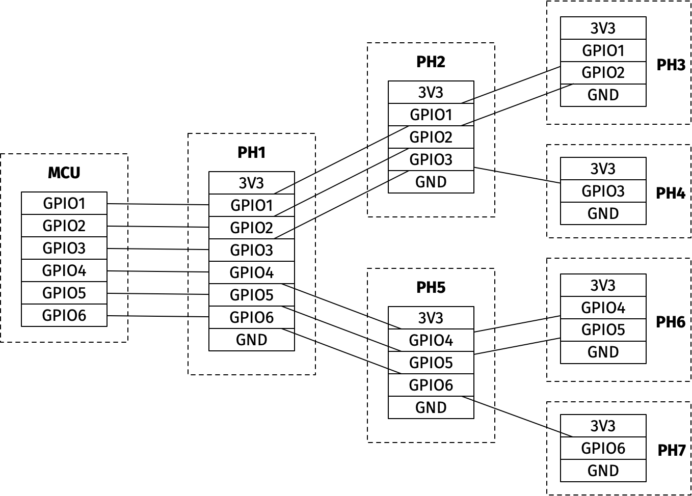

# The Connector Tree

## Rev 1

I had originally designed this mostly stealing from the
[kha](https://github.com/kiu/kha) project, but realized after designing
the PCB below that I really wanted to make power available on every
connector as explained above.

