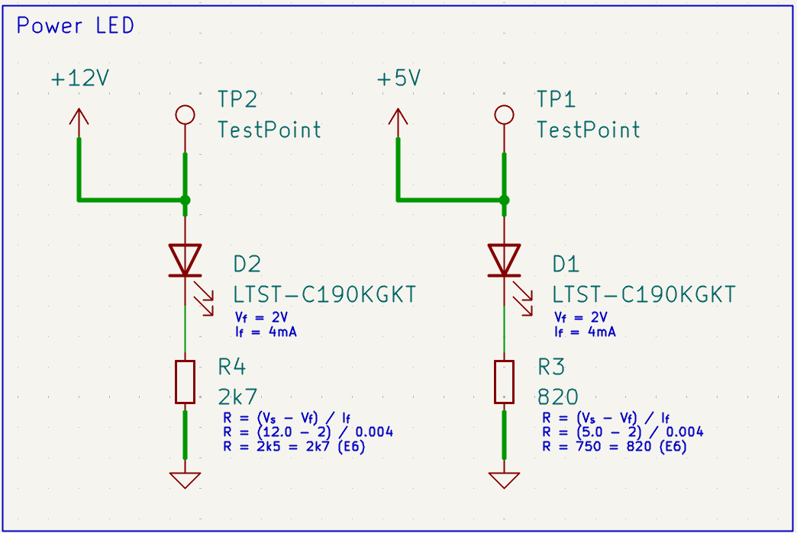

# First Oscillation

One of the things that this project is doing is pushing my skills
designing hardware. An area I had largely avoided until now was [switch
mode power
supplies](https://en.wikipedia.org/wiki/Switched-mode_power_supply)
(SMPS). For this project, I am planning to use +12V as the base power
rail, +5V as the main distribution rail on the backplane for all the
cards, and then local regulation down to +3.3V. The +5V to +3.3V is
totally doable (and maybe even preferrably done) with a low dropout
(LDO) linear regulator. But the +12V to +5V is a bit more as we're
talking about 5-6A of current needed.

SMPS are typically _very efficient_, and I was hoping to use that to my
advantage. It's not that I really need the efficiency, but it's like
with machining, you always work to tight tolerances so when you need
them, you know how. TI has an [amazing
tool](https://webench.ti.com/power-designer/) for building out power
circuits, and with some knob twiddling, it spit out a design based
around the [TPS566238](https://www.ti.com/product/TPS566238), a wee
little QFN package (3mm) that would have a target efficiency of 95%.
Perfect!

In this post, I'm hoping to dive into a bit of the design and some logic
around it all.

## The Centerpiece

Before digging into the specific implementation, let's talk about the
chip that it is built around. The
[TPS566238](https://www.ti.com/product/TPS566238) is a _quite modern_
regulator for an SMPS. On the surface, the implementation is pretty
simple:

That's it, right? Well, almost, but not quite as we'll see in a bit.

As I said earlier, part of the driver is the efficiency of the design,
which you can see here:

The part can support up to 6A of output current, which makes it perfect
for the use case. In addition, it has something like a 50&micro;A
quiescent current. Quiescent current being, very roughly, the "overhead"
of the chip, or the power that's used that isn't contributing to the
switching and outputs. It's more than that, but that's a close enough
definition for these purposes.

## The Beginning and the End

{: width=300 align=right }

It all starts with power coming in at +12V, and going out at +5V. Since
the project is built around a DIN 41612-based backplane, we need to tie
all that together. As you can see from the schematic to the right, we
are using quite a few pins for power. The typical DIN 41612 connector is
rated at 2A _per contact_, so with 8 pins (4 at the "top", and 4 at the
"bottom"), that gives us a capacity of 16A, and while we'll need to
derate the capacity, we won't need to do so more than 15-20%, leaving us
plenty of excess current-carrying capacity.

Additionally, there are quite a few ground pins spread out through the
connector. I think it's [Rick
Hartley](https://www.protoexpress.com/blog/rick-hartley-pcb-design-recommendations-to-minimize-emi/)
that recommends almost 50% grounds, I figured that since I was not doing
anything truly high-speed, that about 25% would be more than enough. 

Now that we have both a source and sink for current, let's dig into the
meat of the design.

## Theory to Reality

The "typical application" shown in many data sheets is a highly
simplified version of the reality, but it's not misleadingly so. What I
ended up with, in the first round at least, was this:

You'll see along the schematic, that there's a lot of text boxes with
various specs in them. These exist because, quite honestly, I wanted to
keep my thought process and decisions localized to the schematic for
future me to use. A few things to call out:

1. I upped the inductor from 1.5 to 2.2uH, while keeping the DC
   resistance (DCR) and saturation current (IDC) roughly the same. The
   part I chose was [Pulse
   BMQ](https://productfinder.pulseelectronics.com/api/open/part-attachments/datasheet/BMQE000404111R0MAA)
   part. This is a shielded inductor with an DCR of 8.5m&ohm; and an IDC
   of 12.5A. The additional inductance allows for a lower minimum input
   voltage.
2. I used a similar mix of capacitor packages as recommended, although
   slightly fewer 0402 packages. Smaller packages reduce the loop
   inductance of the circuit. I also tried to streamline the bill of
   materials (BOM) a bit by using multiple of certain capacitors rather
   than one large one. Everything on the board is either Murata or TDK
   X7R, with the exception of one X5R composition.
3. The feedback (FB) circuit is built with 1% Vishay
   [CRCW](https://www.vishay.com/en/product/20008/) thick-film
   resistors. They're about $0.01, or less, in any quantity.
4. I didn't do anything with the enable (EN) pin. The datasheet is clear
   that if left unconnected, the internal pull-up resistor will activate
   the chip.

That's it. Other than the tiny passives, it's not a super complicated
circuit.

## Blinking (or not) Lights

Everything needs more lights, although in this case, they shouldn't be
blinking.  The last little bit of the circuit was a test point and some
LEDs:

Again, as before, all the math and calculations around current-limiting
resistors is included in the schematic. The
[LTST-C190KGKT](https://optoelectronics.liteon.com/upload/download/DS22-2000-074/LTST-C190KGKT.PDF)
are small 0603 LEDs. While I could have gone bigger, I'm trying to push
myself to work with smaller components, as that's just the direction the
industry is going in.

## The Result

I shipped the designs off to [JLCPCB](https://jlcpcb.com/), which is the
contract manufacturer I use almost exclusively, and after getting the
boards back, I did a janky job of soldering up everything, and
identified a few design issues:

1. The QFN package is stupidly small. Like, just insane. But, I did
   manage to get it soldered the first time by applying a tiny bit of
   solder to the pads and then using a hot air reflow station.
2. The default footprint for the inductor is just barely too small, and
   required some finessing to get it to actually solder to the PCB.
3. I put an 0402 _right up against_ the inductor, and that was just
   stupidly hard to solder. I went through 3-4 of them (cheap!) before I
   finally got something kinda not terrible.

{: align=right width=200 }

On first power up on a bench power supply with 12V and current heavily
limited, there was no smoke, which, given my inexperience here, and my
lousy soldering, is quite surprising. It even generated 5V. 

It also generated not great output (about 500mV ripple) at around 3kHz
and a rather annoying 17kHz audible squeal which I could never quite
identify the source of. I think it was some kind of reverse microphonics
with the inductor because I could press on it and get the volume to
change. Fun! I think the output ripple _might_ be related to not having
much load on it, as I couldn't find my programmable load in the
basement. SMPS don't really like being unloaded, and a 2W resistor
didn't help much there.

One final area I was worried about was whether or not temperature would
be an issue, so I let it run with what little load I could generate for
a while, and watched it on an IR camera.

As you can see, both the inductor and the regulator/controller both
stayed in a very safe range of 34.4-3.45&deg;C. I'll need to verify this
under load to have any confidence in the design, but that means finding
my programmable load.

Once I've got that, I need to run down those two issues. But, hey, for a
first SMPS ever, using tiny freaking parts, there was, in fact, no smoke
in the smoke test. So, for now, I'm happy.