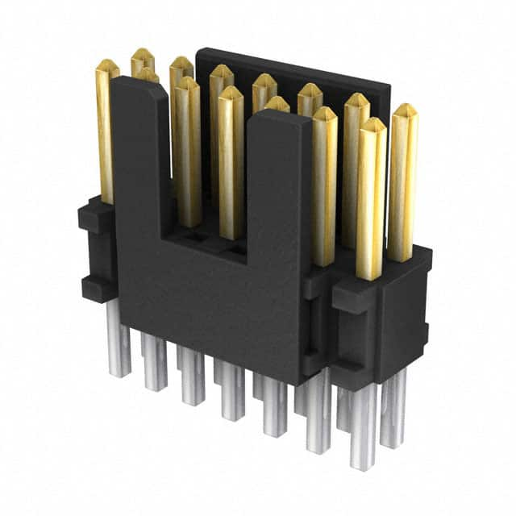
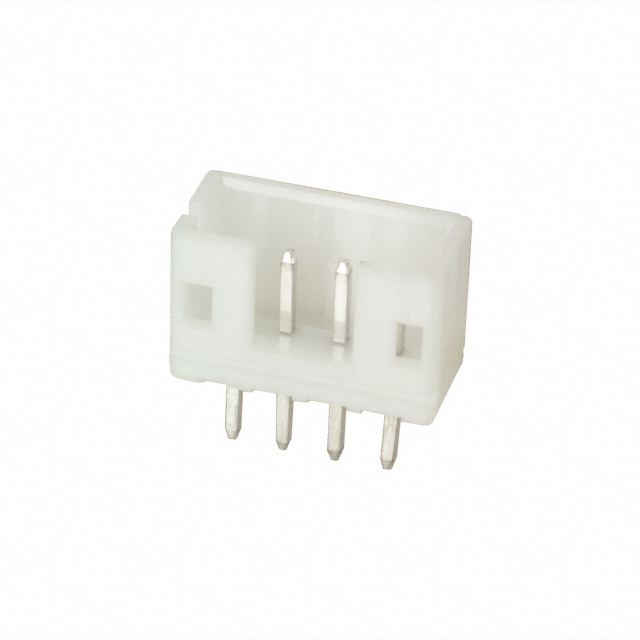

# A Modular Base Board

One of the things that really delighted me with the
[kha](https://github.com/kiu/kha) project is the use of a common PCB for
the rack, and having it designed in such a way as to allow many
different applications. I decided I wanted to do the same thing, but
obviously with my own spin on it.

## Goals

The design has the following goals:

1. A single re-usable PCB that can be used for 90% of the use cases.
2. Flexibility in programming and debugging
3. Local power regulation that leverages the +5V rail on the backplane.
4. Easy ability to change the run-time configuration.

## Subsystems

I am using the term "subsystem" quite loosely here. Let's think of it
more as just different distinct parts of the base PCB that can be
populated as needed, and used as needed. Obviously some, like power,
will be there all the time, but others may only be present in a small
number of situations.

### Power Regulation

The main power rails of the backplane are +12V and +5V, as is tradition.
But that's not what "modern" microcontrollers run on. They run on, at
most, 3.3V (typically spelled "3v3"), and most can run on much lower
voltage. The STM32H5 series, for example, can run on anything from 1.71
to 3.6V. To simplify things (noise gets even more fun to deal with as
the potential drops), we'll run the board's main rail on 3.3V. 

To get from 5V to 3.3V there are two options. First, we can use a linear
regulator in the form of a low-dropout (LDO) regulator. We could also
use a local switched mode power supply (SMPS). To choose, I think it's
worth thinking about two factor: what's the voltage drop, and what's the
power requirements.

Since we're going from 5 &rarr; 3.3V, that's only 1.7V, which isn't a
huge drop, and well within the capabilities of either type of power
supply. For power, let's look at what the _worst case_ might be for that
3.3V rail:

| Component       | Qty | mA/ea | Total | Note                 |
| --------------- | --: | ----: | ----: | -------------------- |
| STM32H503       |   1 |   200 |   200 | &sum;IV~VDD~         |
| ATA6561         |   1 |  0.35 |  0.35 | CAN transceiver      |
| LED             |  16 |    20 |   320 | Typical I~f~         |
| ESP32-C3-MINI-1 |   1 |   350 |   350 | TX 802.11b @ 20.5dBm |

That gets us a total of around 520.35mA for most situations, but 870.35
with an ESP32 with its WiFi radio lit up. Let's call that 900mA. Note,
this doesn't include the 5V drive for the CAN transceiver, for example,
which is typically 50mA when dominant, but is taken directly from the
backplane rail. Most other STM32 CPU are actually lower &sum;IV~VDD~
(the maximum current present across all V~DD~ pins) by 50-80mA.

{: width=240 align=right }

Since there's not a massive amount of current, the plan is to use an
[AP2114-3.3](https://www.diodes.com/part/view/AP2114/) fixed-output LDO
regulator. This is a super simple device that requires a very simple
circuit to implement, as shown to the right, which can deliver 1,000mA
(1A). The only addition is a tiny voltage divider to drive the EN
(enable) pin high from the +5V rail. The total cost for the circuit,
assuming 10 instances of it, is:

| Component                                                                                                             | Qty |   Unit |  Total |
| --------------------------------------------------------------------------------------------------------------------- | --: | -----: | -----: |
| [AP2114H-3.3](https://www.digikey.com/en/products/detail/diodes-incorporated/AP2114H-3-3TRG1/4470756)                 |   1 | $0.332 | $0.332 |
| [4.7uF MLCC 0805 capacitor](https://www.digikey.com/en/products/detail/murata-electronics/GRM21BR71C475KE51L/6606095) |   2 | $0.104 | $0.208 |
| 0603 100mW &plusmn;1% SMD resistor                                                                                    |   2 |  $0.01 |  $0.02 |

That gets us to a whopping $0.56USD for the regulator circuit.

We do need to think about [junction
temperature](https://en.wikipedia.org/wiki/Junction_temperature), so
let's do a quick calculation of the "worst case" of a full 1A of power.

$$\begin{align}
P &= (V_{in} - V_{out}) \times I_{out} + (V_{in} \times I_{Q}) \\
  &= (5 - 3.3)\times 1 + (5\times 0.065) \\
  &= 1.7 + 0.325 \\ 
  &= 2.025\textrm{W}
\end{align}
$$

So the most we might dissipate is 2W at _full load_. So, what does that
do to the junction temperature? Let's assume a 40C wost-case ambient
temperature (T~A~) and a
[TO-252-2](https://en.wikipedia.org/wiki/TO-252) (that's what the H in
the part number refers to) package.

$$\begin{align}
T_J &= T_A + (\theta_{JA}\times P) \\
    &= 40 + (35 * 2.025) \\
    &= 110.875\textrm{C}
\end{align}
$$

The device has a thermal shutdown (T~OTSD~) of 160C, so we are safely
within the margins of the device. This is before we take into account
the use of the ground plane as a heat sink off the package tab.

### STDC (STM32 JTAG/SWD and VCP)

{: width=150 align=right }

Every board needs the ability to be programmed and debugged. The
standard in the STM32 ecosystem is the STDC connector, which provides
multiple functions simultaneously, and is typically exposed via a 0.500"
pitch 14-pin connector like the one shown here.

The pin-out according to
[UM2448](https://www.st.com/content/ccc/resource/technical/document/user_manual/group1/99/49/91/b6/b2/3a/46/e5/DM00526767/files/DM00526767.pdf/jcr:content/translations/en.DM00526767.pdf)
is:

| Pin | Function   | Pin | Function   |
| --- | ---------- | --- | ---------- |
| 1   | NC         | 2   | NC         |
| 3   | VCC        | 4   | JTMS/SWDIO |
| 5   | GND        | 6   | JCLK/SWCLK |
| 7   | GND        | 8   | JTDO/SWO   |
| 9   | JTCLK      | 10  | JTDI       |
| 11  | GND Detect | 12  | NRST       |
| 13  | VCP_RX     | 14  | VCP_TX     |

The pins are for JTAG (J pins) or SWD (SW pins), along with the virtual
communications port (serial port) on the VCP pins.

{: align=left width=200 }

Unfortunately, those Samtec connectors [aren't
cheap](https://www.digikey.com/en/products/detail/samtec-inc/FTSH-107-01-L-DV-K-A/7443623),
running close to $4USD _each_. Instead, I'm planning to leverage the
[Tag-Connect](https://www.tag-connect.com/) system, which uses a set of
spring-loaded pins to touch contacts on the board that don't require a
dedicated header to be installed. The
[TC2060-IDC-050](https://www.tag-connect.com/product/tc2070-idc-050)
model fits the STDC use case perfectly.

For this situation, it's just a special footprint on the PCB. That
footprint looks something like this:

They're, effectively, free. And, if you use
[ENIG](https://en.wikipedia.org/wiki/Electroless_nickel_immersion_gold)
finish, _very_ durable.

### Serial Console (maybe?)

This is one I'm not completely sure of. There's a "serial port" on the
VCP part of the STDC header shown above, and this is probably all that's
needed. Still, I keep thinking maybe I should expose a dedicated serial
port for ... reasons that I cannot explain, other than "more ports
better".

### USB Connector (maybe?)

This is also a maybe for me. It's not really clear what the use for the
connector would be, and it's also unclear if it would make sense for it
to be either a host or peripheral connector as well. I can imagine there
being the possibility of an interesting use case of attaching devices to
the USB bus, however, so I'll likely include one. Whether it'll be a USB
micro or a USB-C is yet-to-be-determined.

### MicroSD Socket

One thing that I do want to include is a micro SD card connector. This
will allow for future expansion of both memory, but also potentially
allowing the SD card to contain the configuration for the board, which
might allow _every_ board to be flashed with identical firmware.

This will likely be done with a [CUI MSD-1-A
connector](https://www.cuidevices.com/product/interconnect/connectors/memory-card-connectors/sd-card-connectors/msd-1-a).

### Connector Tree

{: align=right width=150 }

This is the pièce de résistance that I am lifting from the original
design. The basic gist of it is that you pull GPIO/I2C/SPI signals out
to something like an 8-pin connector, then you fan it out to 2 smaller
connectors, and then potentially fan it out further to even smaller
connectors. This allows you to pick and choose what you need. You don't
even need to put all the connectors on the board unless you need them,
saving money further.

For a connector, I'm using the ubiquitous [JST
PH](https://www.jst.com/products/crimp-style-connectors-wire-to-board-type/ph-connector/)
that you see everywhere. For example, in one variant, it's used for
Adafruit's [STEMMA
connectors](https://learn.adafruit.com/introducing-adafruit-stemma-qt/what-is-stemma).
It's widely used, distributed, and a very durable connector. 

### Power Connectors

One of the things that I was thinking of doing is providing a bank of
power connectors. These could be used to provide 3.3V, 5V, or 12V to
front-panel devices directly from the board. They don't need to carry a
lot of current and I want to use a small connector, so I'm thinking of
using the same JST PH connectors as the signal tree, but in different
sizes so that hopefully I won't accidentally plug a signal into a 12V
power source. 

This is an area that I just haven't fully thought through yet. For
example, the ubiquitous OLED screens need, typically a 5-12V input that
is then used locally to boost to the drive voltage. EPD (e-ink) screens
typically leverage 3.3V to feed the driver circuit. I'm not even sure
there's a real use-case for 12V here, which could simplify things. 

### ESP32 Footprint

{: width=150 align=left }

There are a few use cases where I can imagine wanting to have a WiFi
"modem" available. To do that, I'm intending to place the necessary pads
on the PCB for an
[ESP32-C3-WROOM-1](https://www.espressif.com/sites/default/files/documentation/esp32-c3-mini-1_datasheet_en.pdf)
module. This is a [RISC-V](https://riscv.org)-based module. The package
is only 16x13mm, and includes a PCB antenna. This will likely be against
the upper edge of the card so that the copper exclusion zone necessary
for the antenna doesn't interfere with the main function of the board. 

This will be hung off one of the UART channels of the STM32
microcontroller, and programmed with the [ESP32 AT
firmware](https://github.com/espressif/esp-at), which presents a full
TCP/IP stack, with TLS, HTTP, and even MQTT support, over a crazy
modified [Hayes](https://en.wikipedia.org/wiki/Hayes_AT_command_set) [AT
command
set](https://docs.espressif.com/projects/esp-at/en/latest/esp32/AT_Command_Set/index.html).
I believe it maxes out (or maybe just defaults to) 115,200bps, which
should be fine for most any real application like checking network time
or web APIs. If that ends up being not enough, there is an SPI interface
option that can run 10x faster. 

### Status LEDs

Every computer needs blinking lights. This much is indisputable. So
every board will have a few selection of lights for power rail status,
MCU status, and maybe CAN bus status. These will likely just be 0603 or
0805 surface mount LEDs on the PCB itself. There may, however, be a
front-panel LED that is just a "power good" LED. That would be connected
to a dedicated connector on the PCB.

### Reset Switch

{: align=right width=150 }

Finally, every computer needs a physical reset switch. In this case,
tied to the NRST pin on the controller. When this gets pulled low, the
processor goes into system reset. The plan is to use these small
surface-mount tactile switches at the _very front_ of the PCB that will
be able to be pressed via a small rod (paperclip, naturally) through a
small hole in the front panel.

## Next Steps

I have a first prototype of the connector tree part of the board I've
done, but I'm not happy with it. I'm planning to go back to the drawing
board once I pick a specific MCU so that I can optimize the design to
maximize the flexibility of alternate functions on various pins. In
addition, the initial design didn't have any power on the connectors, so
you had to depend on the MCU to source power, which isn't a great way to
drive a lot of things.