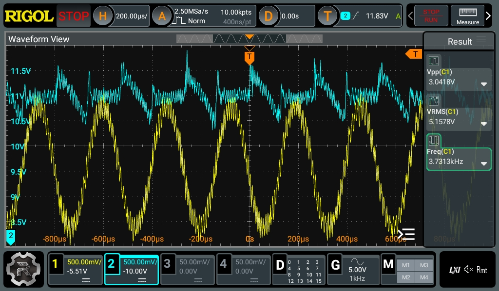

# Oh No, Not That Kind of Oscillation

OK, so maybe things are not happy in switched mode land. In addition to
the issues identified in the [previous post](first-oscillation.md),
things are, to be fair, _not good_. The first issue is, I think, a minor
one. I accidentally misread the datasheet and the `P` part doesn't have
a soft-start pin, but a power good pin. This didn't turn out to be a
major issue, but more an annoyance.

The more substantial issue is this ...

That is, to use a technical term, not good. Not good at all.

Channel 1 (yellow) is the (attempted) 5V output. Channel 2 (cyan) is the
11V input. As you can see from the squiggly nature of the traces, things
are unwell in the land. Just a few of the horrors:

1. The output is swinging *3 volts*, mostly around 5V, at least? This is
   not a good thing, and is what we might call "excessive ripple". Also,
   the ripple has ripple, which, if you're not Xzibit, is probably not a
   good thing.
2. The "ripple" is at 3.7kHz, which is a strange frequency that I can't
   seem to figure out the origin of.
4. The input is ... well, I wouldn't expect it to be swinging a full
   0.5V in either direction from the 11V setting that it was at.

Further digging into it, just doesn't lead to any rational understanding
of the situation. All the capacitors measure reasonably with an LCR
meter (in circuit, so accuracy isn't great). Putting it under load, when
you get above 2A, the ripple shrinks suddenly to approximately 150mV,
which, while still high, is much more sane.

I'm honestly flummoxed.